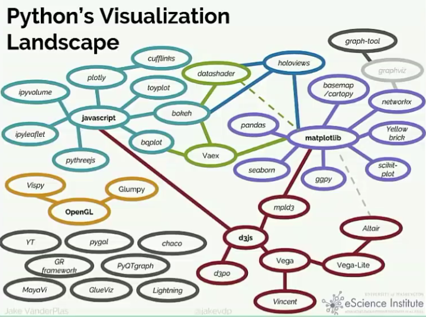
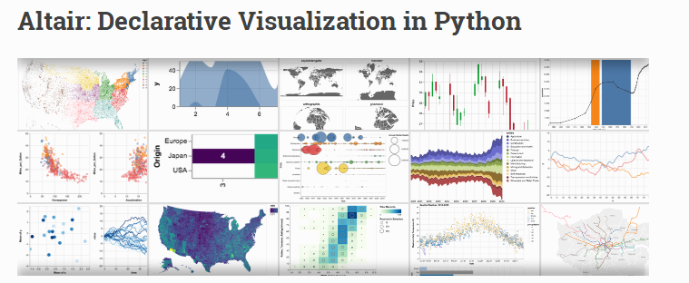

# Python可视化库介绍

[TOC]


## 全体


## matplotlib系

### matplotlib
### pandas
### seaborn
### ggpy
### scikit_plot
### Yellow brick
### basemap/cartopy
### networkx


## matplotlib相关系

### holoviews
### datashader
### Vaex


## javascript系
### plotly
### bokeh
### bqplot
### pythreejs
### ipyleaflet
### ipyvolune
### toyplot
### cufflinks

## d3.js系
### mpld3
### d3po
找不到

## vega系
### vincent
### vega-Lite
### altair
地址：https://altair-viz.github.io/
例子：https://altair-viz.github.io/gallery/index.html

Altair是基于Vega和Vega- lite的Python声明性统计可视化库。
Jupyter Notebook需切换渲染器
```python
alt.renderers.enable('notebook')
```
可保存成png，svg，json，html：https://altair-viz.github.io/user_guide/saving_charts.html

不能交互。

## OpenGL系
### OpenGL
### vispy
### Glumpy


## graphviz 系
### graphviz
### graph-tool


## 其他系
### YT
### pygal
### chaco
### GR framework
### PyQTgraph
### MayaVi
### GlueViz
### Lightning

## svg系
### svg.charts
### svgwrite


GooPyCharts
pyecharts
