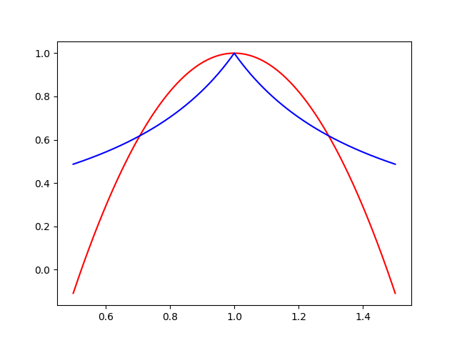
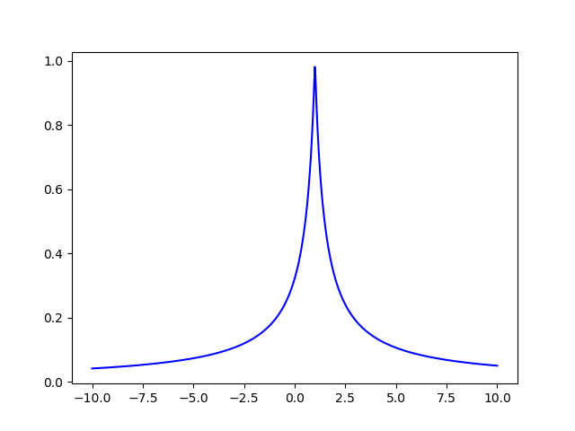

# 曲线拟合度分析

本文分析几种拟合度指标的性能。

[TOC]


## 几种拟合度评价指标

对于序列$Y_{i}$，其拟合值为$y_{i}$。序列$Y_{i}$的平均值为$\bar Y$，拟合值的平均值为$\bar y$。序列$Y_{i}$的方差为$S$，拟合值的平均值为$s$。

### 拟合优度$R^2$
$$ R^2=1-\frac{\sum_{i=1}^{n}(y_{i}-Y_{i})^2}{\sum_{i=1}^{n}(Y_{i}-\bar Y)^2} $$
范围$[-\infty,1)$
### 拟合度$E$
本文提出一种新的拟合程度度量$E$，公式如下：
$$ Z = \frac{k\sum_{i=1}^{n}(|y_{i}-Y_{i}|^p)}{\sum_{i=1}^{n}(|Y_{i} - \bar Y|^p)+\varepsilon} $$
$$E= \frac{1} {Z^\frac{1}{p}+1}$$
其中$p>0$，一般$p=2$时$k=1$，$\varepsilon$取一个小数如$2^{-50}$，$E$范围在$(0,1]$

## python实现代码
```python
import numpy as np

def R2_fun(y, y_forecast, testing):
    # 拟合优度R^2
    y_mean=np.mean(y)
    return 1 - (np.sum((y_forecast - y) ** 2)) / (np.sum((y - y_mean) ** 2))

def E_fun(y, y_forecast, testing, error_power, error_k, error_epsilon):
    # 拟合度E
    y_mean=np.mean(y[-testing:])
    z = (np.sum((abs(y_forecast[-testing:] - y[-testing:])) ** error_power)) / (np.sum((abs(y[-testing:] - y_mean)) ** error_power) + error_epsilon) * error_k
    return 1 / (1 + (z) ** (1 / error_power))

```
## 实验
### 1
用正弦曲线来做实验。取两条相位相同但是幅度不一样的曲线做对比。取n条幅度不一样的正弦曲线作为拟合曲线。
```python
import matplotlib.pyplot as plt

n= 1000
b = 10
c = 100
A = np.linspace(0.5, 1.5, n)
error_power = 2
k = 1
error_epsilon = 2 ** -50

x = np.linspace(0, 1, n)
y = np.sin(x) * b + c
y_forecast = [A[i] * np.sin(x) * b + c for i in range(n)]

R2 = [R2_fun(y, y_forecast[i], n) for i in range(n)]
E = [E_fun(y, y_forecast[i], n, error_power, k, error_epsilon) for i in range(n)]

fig= plt.figure()
plt.plot(A, R2, 'r')
plt.plot(A, E, 'b')
```

### 2
观察$E$随幅度的变化。
```python
A = np.linspace(-2, 2, n)
y_forecast = [A[i] * np.sin(x) * b + c for i in range(n)]
E = [E_fun(y, y_forecast[i], n, error_power, k, error_epsilon) for i in range(n)]

fig= plt.figure()
plt.plot(A, E, 'b')
```

## 结论
$E$在$[0,1)$中变化，可以比较好表示曲线的拟合情况。
